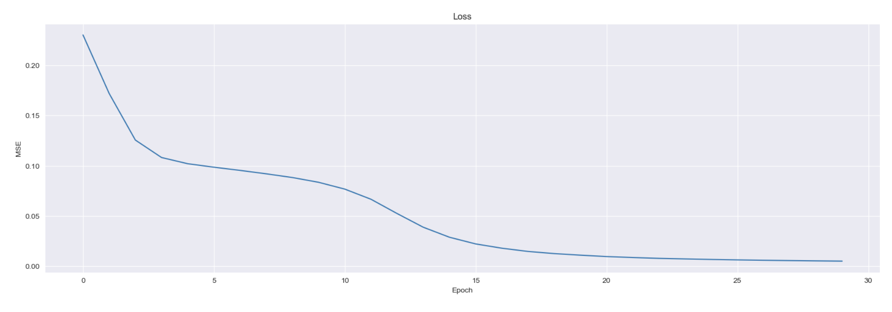

# Lab 1. MLP on NumPy

## Task

Create an architecture for a multilayer perсeptron
classifying [mushrooms](https://archive.ics.uci.edu/ml/datasets/Mushroom).

**All criteria:**

* 2 hidden network layers, sigmoid activation function, gradient descent without optimisers.
* 2 output neurons, according to the number of classes
* Train the neural network and calculate accuracy, precision, recall, F1-measure. Output ROC curve.

---

## Results

Final model has 10 and 5 neurons on the hidden layers.

#### Loss history

#### Metrics 

<table class="results" align="center">
	<tbody>
		<tr>
			<td></td>
			<td>POISONOUS</td>
			<td>EDIBLE </td>
		</tr>
		<tr>
			<td>Accuracy</td>
			<td colspan="2" align="center">0.99722</td>
		</tr>
		<tr>
			<td>Precision</td>
			<td>1.00000</td>
			<td>1.00000</td>
		</tr>
		<tr>
			<td>Recall</td>
			<td>1.00000</td>
			<td>1.00000</td>
		</tr>
        <tr>
			<td>F1 score</td>
			<td>1.00000</td>
			<td>1.00000</td>
		</tr>
	</tbody>
</table>

#### Confusion matrix

#### Roc curve

---

## Sources (English)
1. [Backpropagation (AI by Hand)](https://dongou.tech/ai/dongou/ai-by-hand-%E2%9C%8D%EF%B8%8F-with-prof-tom-yeh-for-ai-professionals/)
2. [A beginner’s guide to deriving and implementing backpropagation (Medium)](https://medium.com/binaryandmore/beginners-guide-to-deriving-and-implementing-backpropagation-e3c1a5a1e536)
3. [How the backpropagation algorithm works (Michael Nielsen)](http://neuralnetworksanddeeplearning.com/chap2.html?source=post_page-----e3c1a5a1e536--------------------------------)
## Sources (Russian)
1. [**Метод обратного распространения ошибки**](https://education.yandex.ru/handbook/ml/article/metod-obratnogo-rasprostraneniya-oshibki) **(Учебник по машинному обучению, Яндекс)**
2. [Перцептрон на NumPy (Хабр)](https://habr.com/ru/articles/711998/)

## Comments for myself
* When passing through the matrix multiplication layer, the gradient is multiplied from the same side by the transposed matrix
* As the gradient passes through the activation sigmoid, the gradient is elementwise multiplied by the derivative of the sigmoid in which the previous intermediate representation is substituted
