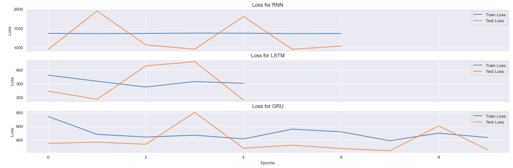
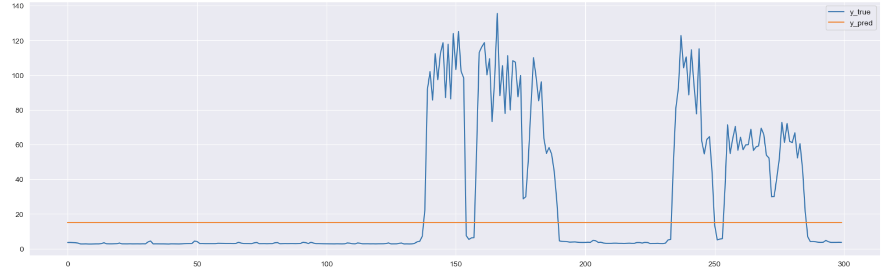
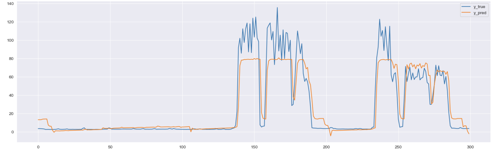
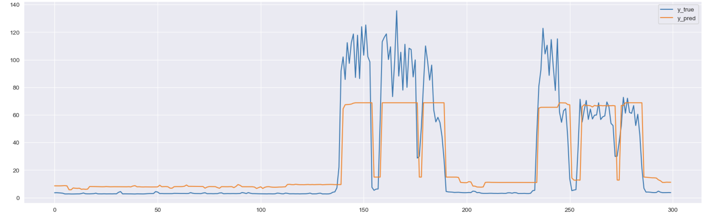

# Lab 3. Recurrent networks on NumPy

## Task
Develop RNN (RMLP), GRU and LSTM to predict the [Usage_kWh](https://archive.ics.uci.edu/dataset/851/steel+industry+energy+consumption) indicator.

Criteria:
* Adjust the hyperparameters to your preference
* Compare the performance of the models in terms of MSE, RMSE and R^2 and draw conclusions

---
## Results
Since the main objective was to compare algorithms, the training used a roughly similar set of hyperparameters, and no attempt was made to bring the quality of each of the recurrence cells up to the best possible result.

### Loss history
MSE

### Metrics

<table class="results" align="center">
	<tbody>
		<tr>
			<td></td>
			<td>MSE</td>
			<td>RMSE</td>
            <td>R^2</td>
		</tr>
		<tr>
			<td>RNN</td>
			<td>1043.764</td>
            <td>32.30</td>
            <td>-0.092</td>
		</tr>
		<tr>
			<td>LSTM</td>
			<td>180.554</td>
            <td>13.43</td>
            <td>0.811</td>
		</tr>
		<tr>
			<td>GRU</td>
			<td>258.007</td>
            <td>16.06</td>
            <td>0.729</td>
		</tr>
	</tbody>
</table>

### Predictions
#### RNN

#### LSTM

#### GRU

## Sources (Russian)
1. [Нейросети для работы с последовательностями](https://education.yandex.ru/handbook/ml/article/nejroseti-dlya-raboty-s-posledovatelnostyami) (Яндекс Учебник)
2. [ML: Рекуррентные сети на PyTorch](https://qudata.com/ml/ru/NN_RNN_Torch.html) 
3. [Обучение рекуррентной нейронной сети](https://www.youtube.com/watch?v=WsXgPD4lmlc&t=364s) (Youtube, Deep Learning School)
## Sources (English)
1. [Understanding LSTM Networks ](https://colah.github.io/posts/2015-08-Understanding-LSTMs/)(colah's blog)
2. [RNN (AI by Hand)](https://dongou.tech/ai/dongou/ai-by-hand-%E2%9C%8D%EF%B8%8F-with-prof-tom-yeh-for-ai-professionals/)
3. [RNN From Scratch](https://www.kaggle.com/code/fareselmenshawii/rnn-from-scratch#Data-Prepartion) (Kaggle)
4. [RNN](https://pytorch.org/docs/stable/generated/torch.nn.RNN.html) (PyTorch Documentation). Also for LSTM and GRU.