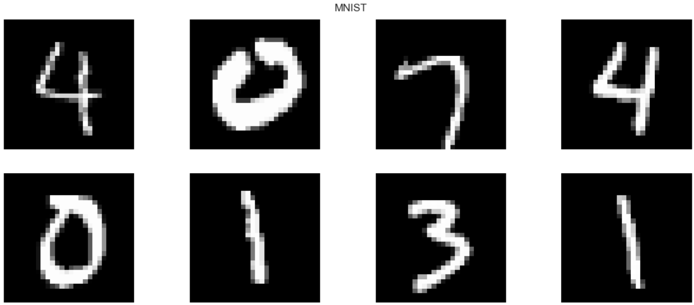
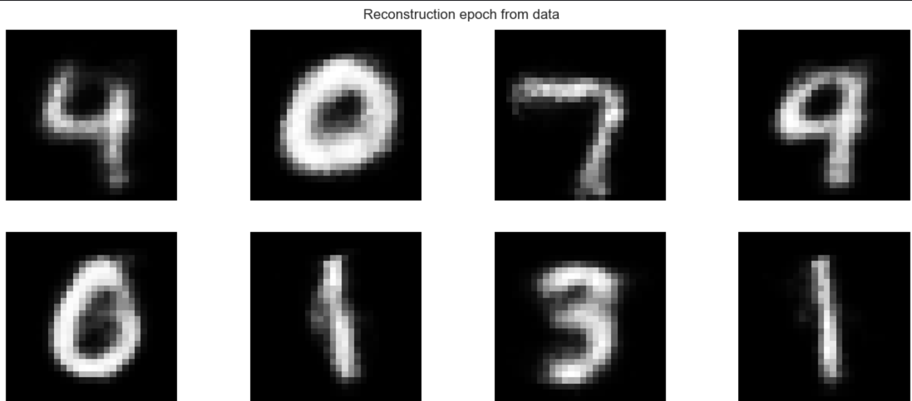
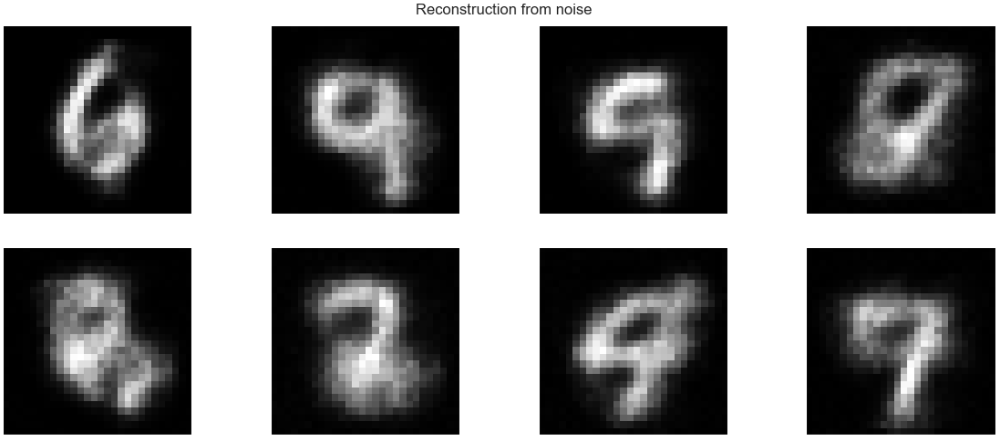
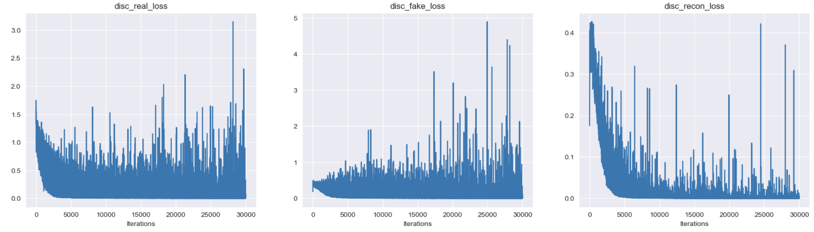
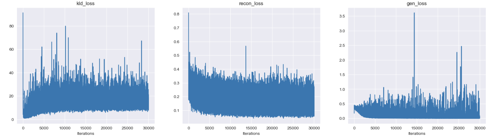

# Lab 4. VAE + GAN

## Task
Develop a GAN+VAE (three-component) neural network for MNIST image reconstruction.

Criteria:
* Adjust all the parameters to your preference.

---
## Results
All components of the network are built on fully-connected layers.

### Encoder
```jupyter
class Encoder:
    def __init__(self, input_dim: int = 784, latent_dim: int = 128, seed: int = 21):
        self.rng = np.random.default_rng(seed)

        self.Encoder = NeuralNetwork()
        self.Encoder.add(Linear(in_neurons=input_dim, out_neurons=512, random_seed=seed))
        self.Encoder.add(ReLU())
        self.Encoder.add(Linear(in_neurons=512, out_neurons=256, random_seed=seed))
        self.Encoder.add(ReLU())

        self.mu_layer = Linear(in_neurons=256, out_neurons=latent_dim, random_seed=seed)
        self.log_var_layer = Linear(in_neurons=256, out_neurons=latent_dim, random_seed=seed)
```

### Decoder
```jupyter
class Decoder:
    def __init__(self, input_dim: int = 784, latent_dim: int = 128, seed: int = 21):
        self.rng = np.random.default_rng(seed)

        self.Decoder = NeuralNetwork()
        self.Decoder.add(Linear(in_neurons=latent_dim, out_neurons=256, random_seed=seed))
        self.Decoder.add(ReLU())
        self.Decoder.add(Linear(in_neurons=256, out_neurons=512, random_seed=seed))
        self.Decoder.add(ReLU())
        self.Decoder.add(Linear(in_neurons=512, out_neurons=input_dim, random_seed=seed))
        self.Decoder.add(Sigmoid())
```

### Discriminator
```jupyter
class Discriminator:
    def __init__(self, input_dim: int = 784, latent_dim: int = 512, seed: int = 21) -> None:
        self.rng = np.random.default_rng(seed)

        self.layer_1 = Linear(in_neurons=input_dim, out_neurons=latent_dim)
        self.activation_1 = ReLU()
        self.layer_2 = Linear(in_neurons=latent_dim, out_neurons=128)
        self.activation_2 = ReLU()
        self.layer_3 = Linear(in_neurons=128, out_neurons=1)
        self.activation_3 = Sigmoid()
```

### Reconstruction results
#### Actual images


#### Reconstructed data


#### Reconstructed noise
Noise from normal distribution, passed through the decoder



### Losses
#### Discriminator losses


#### Other losses


## Sources
