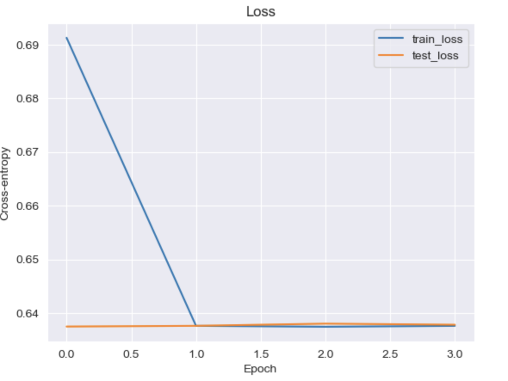
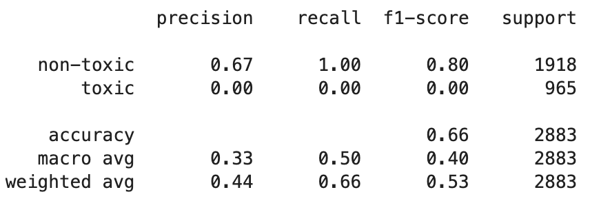

# Lab 5. Transformer

## Task
Build a model to determine the toxicity of comments.

No information on quality metrics or model parameters was provided.

## Data
Toxic Russian Comments From Pikabu and 2ch ([Kaggle](https://www.kaggle.com/datasets/aybatov/toxic-russian-comments-from-pikabu-and-2ch))

---
## Results
The solution is quite primitive (one head in the attention layer and one transformer unit) because the computation was done on the CPU. The low quality was also influenced by the small size of the dictionary, which also increased the training time when the volume increased.

## Sources (Russian)
1. Transformer, Explained in detail (in Russian) ([YouTube](https://youtu.be/iOrNbK2T92M?si=qgplLkvPWCNWZ0GI))
2. Трансформеры ([Яндекс, Учебник по машинному обучению](https://education.yandex.ru/handbook/ml/article/transformery))

## Sources (English)
1. [Layer Normalization, Deriving the Gradient for the Backward Pass](https://robotchinwag.com/posts/layer-normalization-deriving-the-gradient-for-the-backward-pass/).
2. [The Softmax function and its derivative](https://eli.thegreenplace.net/2016/the-softmax-function-and-its-derivative/)
3. [Softmax Back Propagation Solved (I think)](https://tombolton.io/2018/08/25/softmax-back-propagation-solved-i-think/)