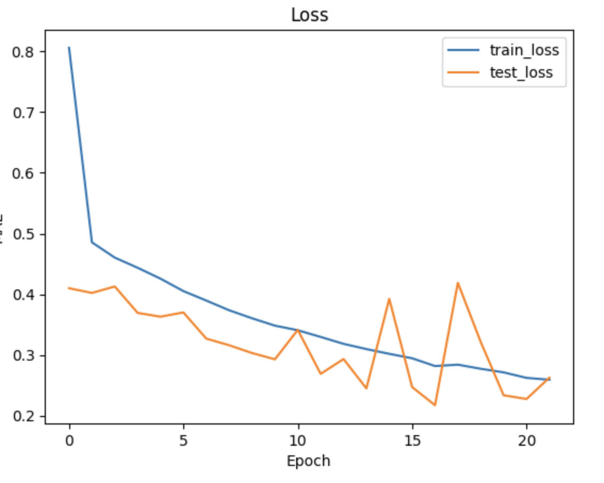
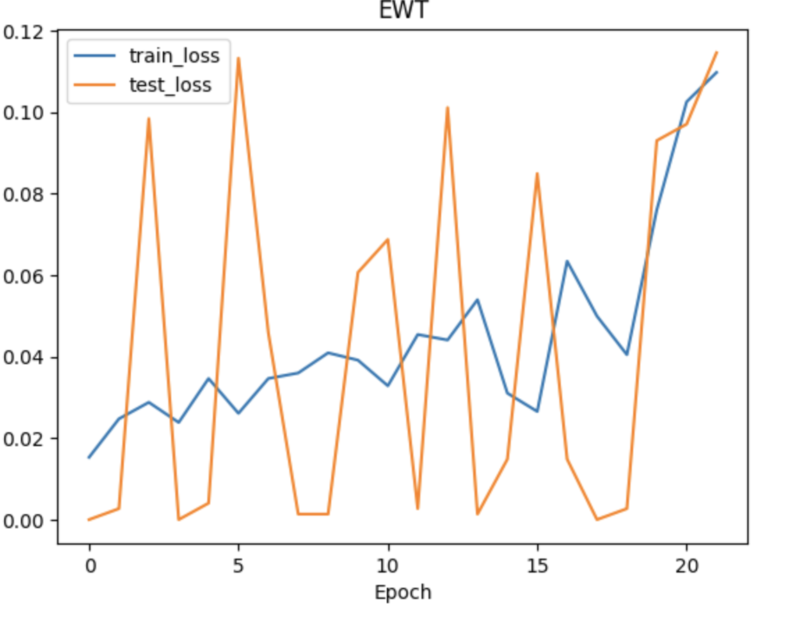

# Lab 6. GNN

## Task
Write a graph neural network to calculate the forbidden band width for two-dimensional transition metal dichalcogenides.

Task description and dataset - https://github.com/HSE-LAMBDA/IDAO-2022.

Criteria:
* The choice of architecture and layer combination is at your discretion.

---
## Results
**NOTE: The network was trained in google colab due to pymatgen package issues.So to successfully reproduce the results, you need to download the dataset from the data folder and add it to the root directory on your google drive.**

Graph in this task consists of embeddings for chemical elements (for atoms of the same element embeddings will coincide at the entrance to the first GCN layer) and adjacency matrix (without weights for edges, where the distance between atoms can be taken into account).

### MAE loss

### EWT

Test R^2 – 0.47

## Sources (Russian)
1.Графовые нейронные сети ([Яндекс, учебник по машинному обучению](https://education.yandex.ru/handbook/ml/article/grafovye-nejronnye-seti))

## Comments
* The graph convolutional layer does not change the graph structure, but only recalculates the embeddings of vertices with respect to edges. Therefore, the adjacency matrix does not change and it can be calculated beforehand.